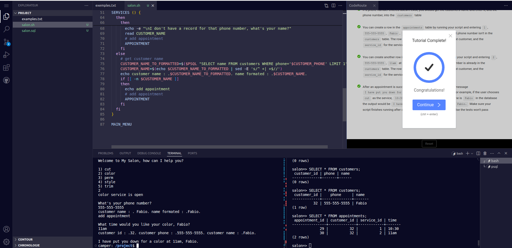
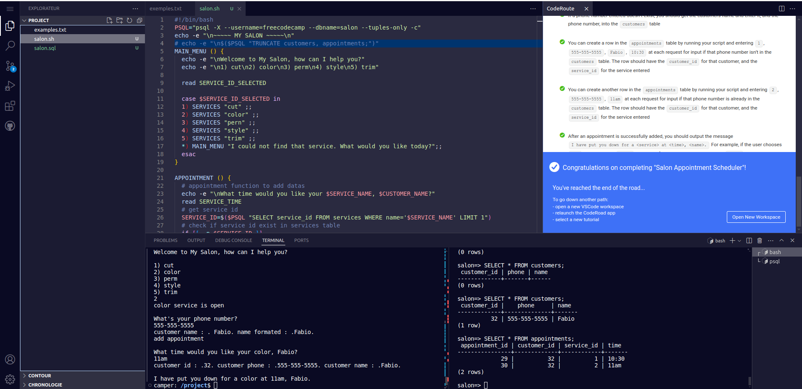

# Build a Salon Appointment Scheduler

For this project, you will create an interactive Bash program 
that uses PostgreSQL to track the customers and appointments 
for your salon.

#### screenshots covers images

#### This is one of the required projects to earn my certification.
Thank freecodecamp for this projet, it's awesome!
